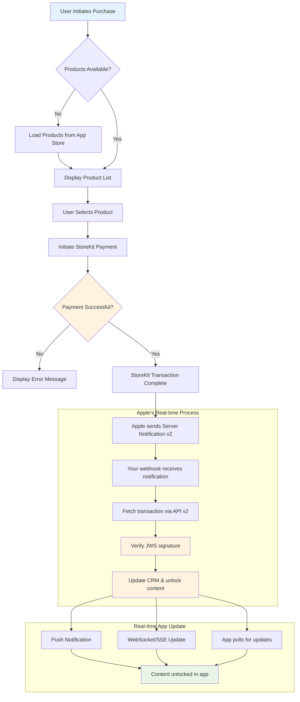
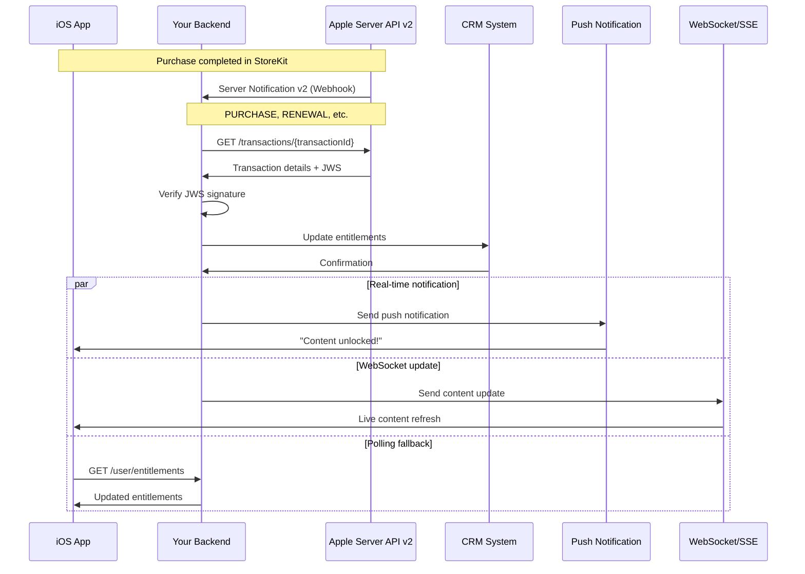
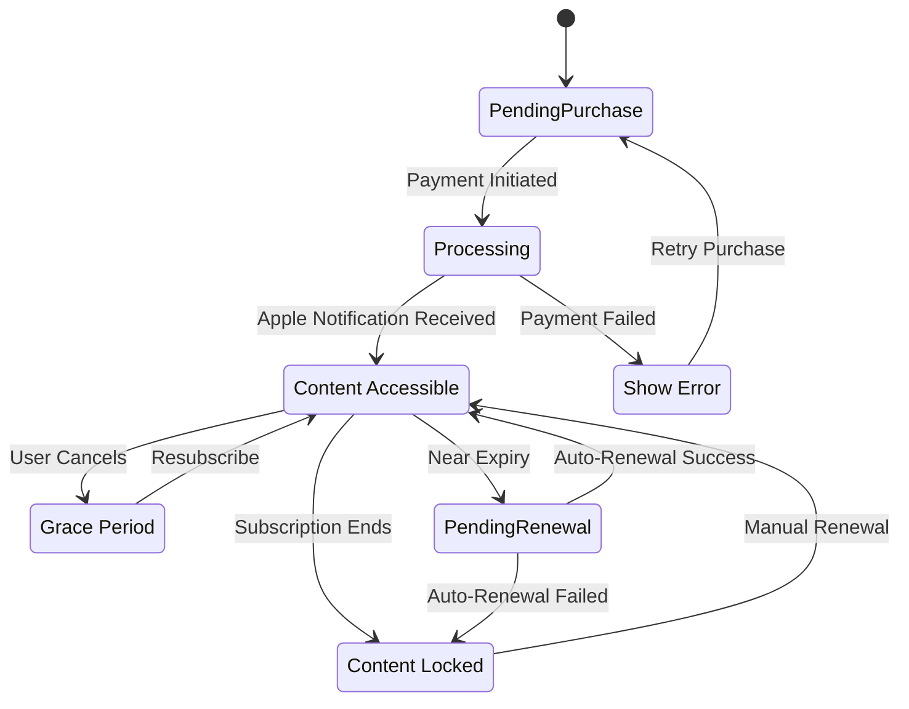
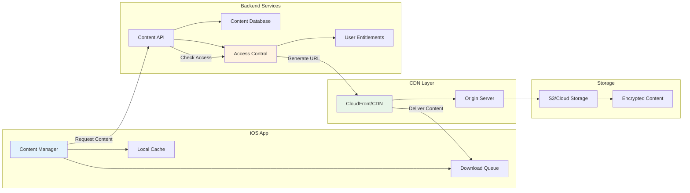
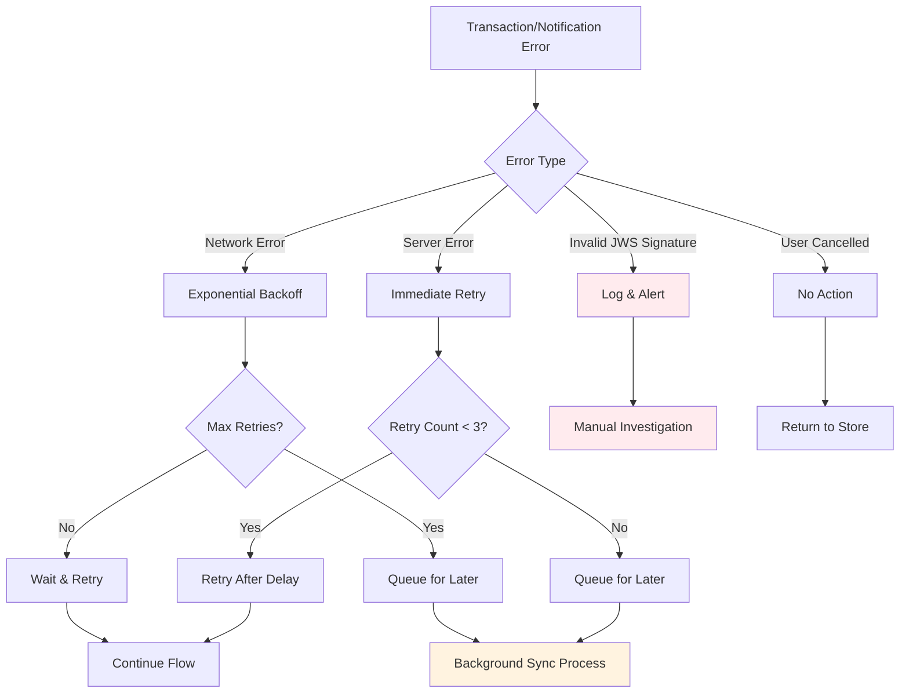
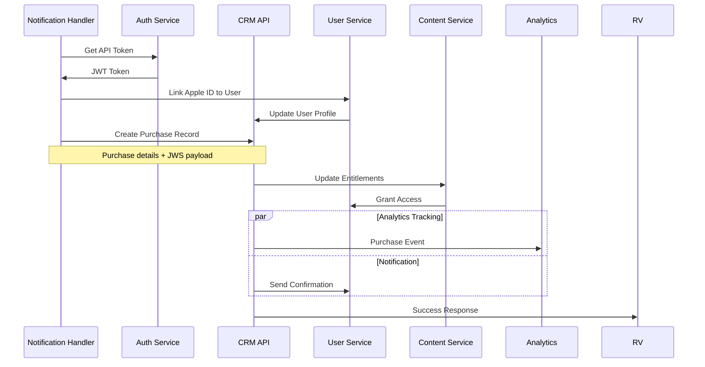
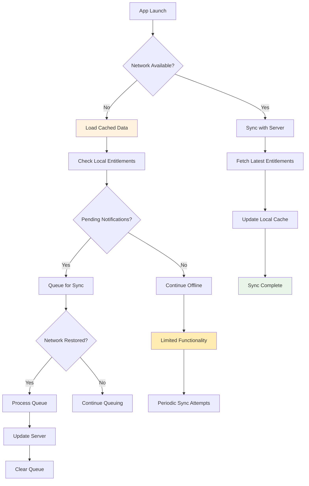
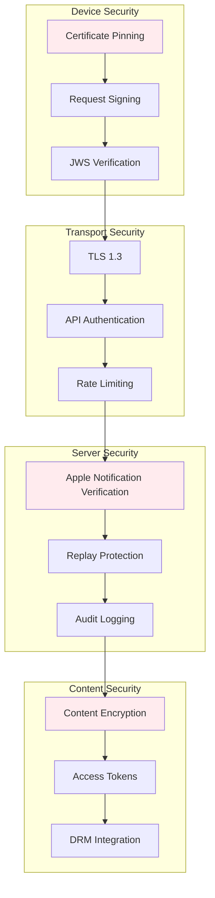
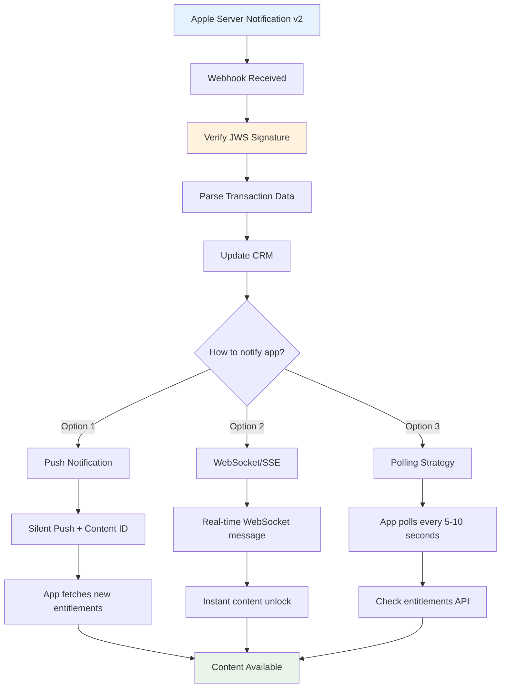
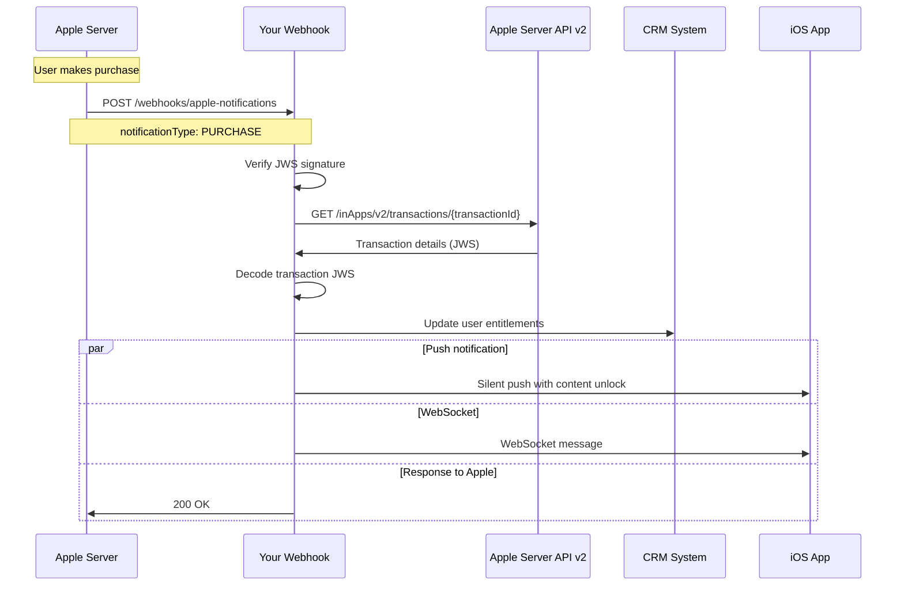

# Apple In-App Purchase Flow Diagrams

## Overview

This document contains detailed flow diagrams for implementing Apple In-App Purchases with CRM integration. Each diagram represents a critical part of the system architecture.

## 1. Modern Purchase Flow (Apple Server API v2)

## 2. Modern Apple Server API v2 Flow (Real-time)

## 3. Subscription Management Flow

## 4. Content Delivery Architecture

## 5. Error Handling and Retry Logic

## 6. CRM Integration Pattern

## 7. Offline Handling Strategy

## 8. Security Implementation Flow

## 9. Real-time Content Unlock Strategies

## 10. Apple Server API v2 Integration

## Implementation Notes

### Modern Apple APIs Required

1. **Apple App Store Server API v2**
   - `GET /inApps/v2/transactions/{transactionId}` - Get transaction details
   - `GET /inApps/v2/history/{originalTransactionId}` - Transaction history
   - `POST /inApps/v2/notifications/test` - Test notifications

2. **Server-to-Server Notifications v2**
   - Webhook endpoint for real-time notifications
   - JWS signature verification
   - Handle notification types: PURCHASE, RENEWAL, CANCEL, etc.

3. **Real-time App Communication**
   - Push Notifications (silent + content)
   - WebSocket/Server-Sent Events
   - Polling fallback mechanism

### Critical Success Factors

1. **Proper Apple Notification Processing**
   - Always process server-side notifications
   - Handle sandbox vs production environments
   - Implement replay attack prevention with JWS verification

2. **Robust Error Handling**
   - Network failure recovery
   - Graceful degradation
   - User-friendly error messages

3. **Content Security**
   - Secure content delivery
   - Access control enforcement
   - Audit trail maintenance

4. **Performance Optimization**
   - Real-time notification processing
   - Content pre-loading
   - Efficient sync mechanisms
