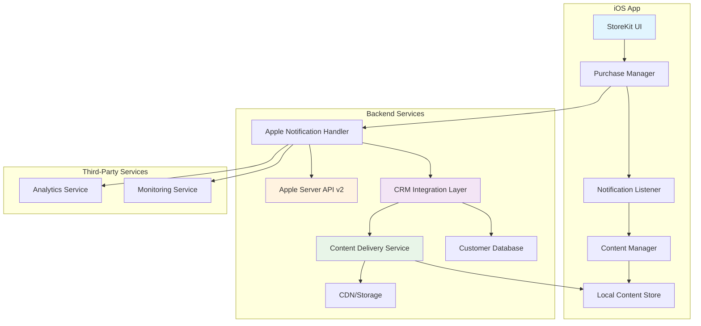

# System Architecture Overview

## Introduction

This document outlines the complete architecture for implementing Apple In-App Purchases while maintaining CRM control over premium content delivery. The design ensures full compliance with Apple's App Store requirements while providing business flexibility.

## Core Requirements

### Apple's Requirements

- All premium digital content must be purchased through IAP
- No external payment methods for digital content
- Proper server-side transaction verification
- Content must be deliverable within the app

### Business Requirements

- CRM-controlled content access
- Enterprise and bulk licensing support
- Unified customer analytics
- Content versioning and updates

## High-Level Architecture



## System Components

### 1. iOS Application Layer

#### StoreKit Integration

- **Purpose**: Handle all purchase transactions through Apple's framework
- **Key APIs**:
  - `SKProductsRequest` for product information  
  - `SKPaymentQueue` for purchase processing
  - Transaction observation and completion

#### Purchase Manager

- **Responsibilities**:
  - Coordinate purchase flow
  - Handle transaction states
  - Manage retry logic
  - Queue offline transactions

#### Notification Listener

- **Function**: Listen for real-time purchase notifications
- **Security**: Implement certificate pinning and JWS verification

#### Content Manager

- **Role**: Control access to premium content
- **Features**:
  - Content caching
  - Progressive download
  - Offline access management

### 2. Backend Services

#### Apple Server Notification Handler

- **Primary Function**: Process real-time notifications from Apple
- **Security Features**:
  - JWS signature verification
  - Replay attack prevention
  - Rate limiting
  - Audit logging

#### CRM Integration Layer

- **Purpose**: Bridge between Apple purchases and business logic
- **Capabilities**:
  - User account linking
  - Purchase history tracking
  - Content access management
  - Business rule enforcement

#### Content Delivery Service

- **Function**: Manage and deliver premium content
- **Features**:
  - Content versioning
  - Progressive delivery
  - Analytics integration
  - CDN optimization

## Data Flow

### Purchase to Content Access Flow

```mermaid
sequenceDiagram
    participant U as User
    participant A as iOS App
    participant AS as Apple Store
    participant NH as Notification Handler
    participant CRM as CRM System
    participant CD as Content Delivery
    
    U->>A: Initiate Purchase
    A->>AS: Process Payment
    AS->>A: Transaction Complete
    AS->>NH: Server Notification v2
    NH->>NH: Verify JWS Signature
    NH->>CRM: Update User Purchases
    CRM->>CD: Authorize Content Access
    CD->>A: Real-time Push Notification
    A->>U: Grant Premium Content Access
    
    Note over A,CD: Content access granted immediately after purchase completion

## Security Considerations

### Transaction Verification Security

- Server-side notification processing only
- JWS signature verification
- Certificate pinning for Apple API calls
- Real-time fraud detection

### Content Protection

- Content encryption at rest
- Secure content delivery URLs
- Time-limited access tokens
- DRM integration for sensitive content

### Data Privacy

- Minimal data collection
- Explicit consent for analytics
- GDPR/CCPA compliance
- Data retention policies

## Scalability Design

### Performance Optimization

- Transaction notification caching
- Content pre-loading
- CDN for global delivery
- Database optimization

### High Availability

- Multi-region deployment
- Failover mechanisms
- Circuit breakers
- Graceful degradation

## Monitoring and Analytics

### Key Metrics

- Purchase conversion rates
- Notification processing success rates
- Content delivery performance
- User engagement metrics

### Alerting

- Failed notification processing
- Service health monitoring
- Security event detection
- Performance threshold alerts

## Compliance Framework

### Apple Requirements

- App Store Review Guidelines compliance
- StoreKit best practices
- Server notification handling requirements
- Content delivery standards

### Business Compliance

- Financial audit trails
- Customer data protection
- Content licensing compliance
- Tax calculation accuracy
