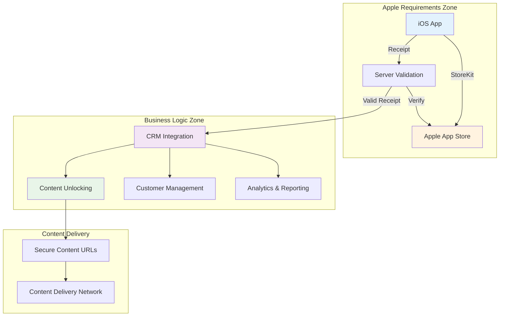

# Apple In-App Purchase Requirements & Compliance Guide

## Overview

This document outlines Apple's requirements for In-App Purchases (IAP) and provides guidance on maintaining compliance while integrating with CRM systems for premium content management.

## Apple's Core Requirements

### 1. App Store Review Guidelines - Section 3.1.1

#### Digital Content Must Use IAP

- All premium digital content, features, or services must be purchased through Apple's In-App Purchase system
- This includes subscriptions, premium features, additional content, and virtual goods
- External payment methods cannot be used for digital content

#### Prohibited Practices

- Directing users to external websites for purchase
- Offering different pricing outside the app
- Using external payment systems for digital content
- Circumventing Apple's payment system

### 2. StoreKit Requirements

#### Proper Implementation

- Use Apple's StoreKit framework for all purchase operations
- Implement proper transaction handling and server notifications
- Follow Apple's recommended security practices
- Handle all transaction states appropriately

#### Server-side Transaction Processing

- Real-time server notifications are mandatory for security
- Use Apple's Server API v2 for transaction verification
- Implement proper error handling for notification failures
- Store transaction results securely

## Compliance Strategy with CRM Integration

### Architecture Overview



### Key Compliance Points

1. **Purchase Flow Compliance**
   - All purchases must originate from the iOS app
   - Users cannot be directed to external payment systems
   - Pricing must be consistent with App Store pricing

2. **Content Delivery Compliance**
   - Content can be delivered from your servers after purchase validation
   - CRM can control content access based on validated purchases
   - No external purchase verification required for content access

3. **Subscription Management Compliance**
   - Apple manages subscription billing and renewal
   - Your CRM syncs with Apple's subscription status
   - Cancellations and refunds are handled by Apple

## Implementation Guidelines

### 1. Purchase Workflow

#### Step 1: Product Discovery

```swift
// Load products from Apple
func loadProducts() {
    let request = SKProductsRequest(productIdentifiers: productIDs)
    request.delegate = self
    request.start()
}
```

#### Step 2: Purchase Initiation

```swift
// Purchase through Apple only
func purchase(_ product: SKProduct) {
    let payment = SKPayment(product: product)
    SKPaymentQueue.default().add(payment)
}
```

#### Step 3: Real-time Notification Setup

```swift
// Setup notification listeners for instant content unlock
func setupNotificationListeners() async {
    await notificationManager.startListening()
    if let entitlements = try? await getUpdatedEntitlements() {
        await unlockContent(entitlements)
    }
}
```

### 2. Server-Side Transaction Processing

#### Essential Security Measures

```javascript
// Handle Apple Server Notifications v2
async function handleAppleNotification(signedPayload) {
    // Verify JWS signature
    const notification = verifyJWS(signedPayload);
    
    // Get transaction details from Apple Server API v2
    const transactionId = notification.data.signedTransactionInfo;
    const transaction = await getTransactionFromApple(transactionId);
    
    // Process the verified transaction
    await processTransaction(transaction);
    
    return { status: 'processed' };
}
```

#### CRM Integration After Notification Processing

```javascript
// Update CRM only after successful Apple notification processing
async function updateCRMAfterPurchase(userId, verifiedTransaction) {
    try {
        await crmAPI.updateCustomerEntitlements({
            customerId: userId,
            productId: verifiedTransaction.productId,
            transactionId: verifiedTransaction.transactionId,
            purchaseDate: verifiedTransaction.purchaseDate,
            platform: 'apple_ios',
            verified: true
        });
        
        await unlockContentForUser(userId, verifiedTransaction.productId);
        await sendRealTimeNotification(userId, verifiedTransaction.productId);
    } catch (error) {
        // Queue for retry - don't fail the user's purchase
        await queueCRMUpdate(userId, verifiedTransaction);
    }
}
```

### 3. Content Access Control

#### Secure Content Delivery

```javascript
// Check entitlements before content access
async function authorizeContentAccess(userId, contentId) {
    // Verify user has valid purchase in CRM
    const entitlements = await crmAPI.getUserEntitlements(userId);
    const hasAccess = entitlements.some(e => 
        e.productId === getRequiredProduct(contentId) && 
        e.status === 'active'
    );
    
    if (hasAccess) {
        return generateSecureContentURL(contentId);
    } else {
        throw new Error('Access denied - no valid purchase');
    }
}
```

## Compliance Checklist

### ✅ Required Implementations

- [ ] **StoreKit Integration**: All purchases use Apple's StoreKit framework
- [ ] **Server Notifications v2**: Handle real-time notifications from Apple
- [ ] **No External Payments**: Zero external payment methods for digital content
- [ ] **Proper Error Handling**: Handle all transaction states and errors
- [ ] **JWS Verification**: Secure verification of Apple's signed notifications
- [ ] **Subscription Sync**: Real-time sync with Apple's subscription status
- [ ] **Content Security**: Secure content delivery after notification processing

### ✅ Prohibited Practices to Avoid

- [ ] **External Payment Links**: No links to external payment systems
- [ ] **Price Discrimination**: No different pricing outside the app
- [ ] **Purchase Incentives**: No incentives to purchase outside the app
- [ ] **Button Labeling**: Purchase buttons must use Apple's required language
- [ ] **Reader App Exception**: Don't assume reader app exemptions apply

### ✅ CRM Integration Best Practices

- [ ] **Post-Notification Updates**: Update CRM only after Apple notification processing
- [ ] **Graceful Failures**: Handle CRM failures without affecting user experience
- [ ] **Data Consistency**: Maintain consistency between Apple and CRM data
- [ ] **Privacy Compliance**: Follow data protection regulations
- [ ] **Audit Trails**: Maintain complete audit logs for purchases

## Common Compliance Issues

### 1. External Payment References

**❌ Prohibited:**

```swift
// Don't do this
Button("Buy on Website") {
    openURL(URL(string: "https://yoursite.com/purchase")!)
}
```

**✅ Compliant:**

```swift
// Do this instead
Button("Purchase Premium") {
    storeKitManager.purchase(premiumProduct)
}
```

### 2. Price Comparison

**❌ Prohibited:**

```swift
// Don't show external pricing
Text("Buy for $9.99 on our website (save 30%!)")
```

**✅ Compliant:**

```swift
// Only show App Store pricing
Text("Premium Course - \(product.localizedPrice)")
```

### 3. Subscription Management

**❌ Prohibited:**

```swift
// Don't direct to external subscription management
Button("Manage Subscription") {
    openURL(URL(string: "https://yoursite.com/account")!)
}
```

**✅ Compliant:**

```swift
// Direct to Apple's subscription management
Button("Manage Subscription") {
    openURL(URL(string: "https://apps.apple.com/account/subscriptions")!)
}
```

## Testing for Compliance

### 1. App Store Connect Testing

```bash
# Test with sandbox environment
export ENVIRONMENT=sandbox
export APPLE_SHARED_SECRET=your_sandbox_secret

# Validate test receipts
curl -X POST "https://sandbox.itunes.apple.com/verifyReceipt" \
  -H "Content-Type: application/json" \
  -d '{
    "receipt-data": "test_receipt_data",
    "password": "your_shared_secret"
  }'
```

### 2. Purchase Flow Testing

```swift
// Test all purchase scenarios
func testPurchaseFlow() {
    // Test successful purchase
    // Test cancelled purchase
    // Test failed purchase
    // Test deferred purchase (family sharing)
    // Test restored purchase
}
```

### 3. Apple Server Notification Testing

```javascript
// Test notification processing scenarios
describe('Apple Notification Processing', () => {
    test('Valid PURCHASE notification', async () => {
        const result = await processNotification(validPurchaseNotification);
        expect(result.status).toBe('processed');
    });
    
    test('Valid RENEWAL notification', async () => {
        const result = await processNotification(validRenewalNotification);
        expect(result.status).toBe('processed');
    });
    
    test('Invalid JWS signature', async () => {
        const result = await processNotification(invalidSignatureNotification);
        expect(result.error).toBeDefined();
    });
});
```

## Monitoring and Maintenance

### 1. Key Metrics to Track

```javascript
// Purchase conversion tracking
const purchaseMetrics = {
    initiatedPurchases: 0,
    completedPurchases: 0,
    failedPurchases: 0,
    conversionRate: 0
};

// Apple notification processing monitoring
const notificationMetrics = {
    successfulNotifications: 0,
    failedNotifications: 0,
    processingLatency: 0
};

// CRM sync monitoring
const crmMetrics = {
    successfulSyncs: 0,
    failedSyncs: 0,
    pendingRetries: 0
};
```

### 2. Alerting Setup

```javascript
// Set up alerts for compliance issues
const alerts = {
    // High notification processing failure rate
    notificationProcessingFailures: {
        threshold: '> 5% in 10 minutes',
        action: 'immediate_alert'
    },
    
    // CRM sync failures
    crmSyncFailures: {
        threshold: '> 10 failures in 1 hour',
        action: 'engineering_alert'
    },
    
    // Purchase completion rate drop
    purchaseCompletionRate: {
        threshold: '< 85% in 1 hour',
        action: 'business_alert'
    }
};
```

### 3. Regular Compliance Audits

```bash
#!/bin/bash
# Monthly compliance audit script

echo "Running IAP compliance audit..."

# Check for external payment references
grep -r "website.*purchase\|external.*payment" src/

# Verify server notifications are properly handled
grep -r "server.*notification\|webhook.*apple" src/ || echo "ERROR: No Apple notification handling found"

# Check for proper StoreKit usage
grep -r "SKPaymentQueue\|StoreKit" src/ || echo "ERROR: No StoreKit usage found"

echo "Audit complete"
```

## Legal and Policy Considerations

### 1. App Store Review Guidelines Compliance

- **Section 3.1.1**: Digital goods and services must use IAP
- **Section 3.1.2**: Subscriptions must use IAP (with limited exceptions)
- **Section 3.1.3**: Content-based apps may qualify for reader exemptions
- **Section 3.1.4**: Hardware-specific content may have exemptions

### 2. Privacy and Data Protection

- **Transaction Data**: Handle Apple notifications securely and privately
- **User Data**: Comply with GDPR, CCPA, and other privacy regulations
- **Third-Party Sharing**: Ensure CRM data sharing complies with privacy laws
- **Data Retention**: Implement appropriate data retention policies

### 3. Financial Compliance

- **Revenue Recognition**: Proper accounting for IAP revenue
- **Tax Obligations**: Handle tax calculations correctly
- **Refund Processing**: Follow Apple's refund policies
- **Subscription Billing**: Comply with auto-renewal regulations

This guide ensures your implementation remains compliant with Apple's requirements while achieving your business objectives through CRM integration.
